<p align="center">
  
</p>

<h1 align="center">⚡ MAYANK ANAND // PASSIONATELY LEARNING DIGITAL VLSI &amp; DV ⚡</h1>

<p align="center">
  <strong>Passionate Learner in Digital Logic, ASIC/FPGA Design, and Design Verification (DV)</strong><br>
  Optimizing Digital Logic Systems | Low Power Architectures | Hyprland &amp; Neovim Ricing Purist
</p>

<p align="center">
  <a href="https://github.com/techanand8">
    
  </a>
  <a href="https://github.com/techanand8/nix-config">
    
  </a>
</p>

---

## 📟 SYSTEM CORE TELEMETRY

```console
mayank@anand-core ~ $ fastfetch --config vlsi.json
```

<table align="center" width="100%">
<tr>
<td width="42%">
<pre>
       <b>/,   ,/,</b>
   <b>//   //   //</b>
  <b>///  ///  ///</b>
 <b>//// //// ////</b>
<b>/////     /////</b>
<b>\\\\\     \\\\\</b>
 <b>\\\\      \\\\</b>
  <b>\\\       \\\</b>
   <b>\\        \\</b>
    <b>\         \</b>
</pre>
</td>
<td width="58%">
<pre font-family="monospace">
<b>USER:</b> Mayank Anand
<b>ROLE:</b> Aspiring VLSI & DV Engineer
<b>SYSTEM:</b> NixOS / Hyprland Riced Environment (Latest)
<b>WORKSTATION:</b> AMD Ryzen + NVIDIA (GPU Optimized)
<b>SHELL:</b> zsh + Neovim v0.10 (Highly Customized workflows)
<b>DOMAINS:</b> Digital VLSI Design & Embedded IoT (Learning)
<b>PASSION:</b> Design Verification (DV) & RTL Synthesis
<b>LATENCY:</b> 0.00ns [Zero-Latency Silicon Focus]
<b>STATUS:</b> Passionately Curious & Learning Daily
</pre>
</td>
</tr>
</table>

---

## 🚀 ENGINEERING PIPELINE

I am an ECE graduate deeply **passionately curious** about the architecture of silicon and future computing hardware. My primary learning paths are in **Digital VLSI Design** and **Embedded IoT**, with the ultimate goal of understanding and coding next-generation hardware designs like **AI Accelerators** and **Quantum VLSI Architectures** for the post-Moore's Law era of computing.

I have a strong affinity for **Design Verification (DV)**. For me, verification is like chip design itself—requiring absolute logic precision, robust SVA configurations, and structural completeness. 

> **Fun fact:** I treat my NixOS system like a chip layout. Every script, dotfile, and custom keybinding is fully optimized, low-power, and routed for maximum efficiency and zero latency.

---

- 🔭 **Current Directive:** Building robust **Embedded IoT prototypes** and configuring ultra-optimized riced Linux environments for smooth, modern RTL design workflows.
- 👯 **Collaborative Target:** Open-Source **EDA Tools**, custom **RISC-V Architectures**, and high-speed **Hardware Accelerators for AI/ML**.
- 🤝 **Seeking Help & Collaborations On:** Advanced **SystemVerilog Assertions (SVA)** and **Low-Power Design Methodologies**.
- 🌱 **Learning Trajectory:** Mastering the **RTL-to-GDSII flow**, deep diving into **UVM (Universal Verification Methodology)**, and researching physical quantum computing layouts.
- 💬 **Ask me about:** VLSI, Embedded Systems, Linux System Ricing (NixOS/Hyprland), and Neovim workflows.

---

## 🏗️ HARDWARE ENGINEERING & PROGRAMMING STACKS

<table width="100%">
  <tr>
    <th width="33%" align="center">🏗️ Silicon Engineering Stack</th>
    <th width="33%" align="center">🛠️ Programming Languages</th>
    <th width="34%" align="center">🖥️ System Ecosystem</th>
  </tr>
  <tr>
    <td valign="top" align="center">
      <br/>
      <br/>
      <br/>
      <br/>
      <br/>
      <br/>
      
    </td>
    <td valign="top" align="center">
      <br/>
      <br/>
      <br/>
      <br/>
      
    </td>
    <td valign="top" align="center">
      <br/>
      <br/>
      <br/>
      <br/>
      
    </td>
  </tr>
</table>

---

## 📊 TELEMETRY MODULES // GITHUB CORE STATUS

<table align="center" width="100%">
  <tr>
    <td width="50%" align="center">
      
    </td>
    <td width="50%" align="center">
      
    </td>
  </tr>
  <tr>
    <td colspan="2" align="center">
      <br/>
      
    </td>
  </tr>
</table>

---

<p align="center">
  <a href="https://visitcount.itsvg.in">
    
  </a>
</p>
