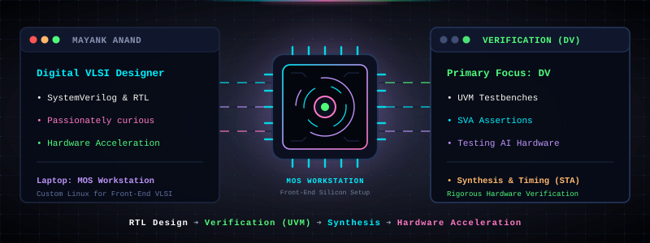

  

<h1 align="center">Mayank Anand</h1>

  <strong>ECE Graduate | Digital VLSI Designer | Design Verification (DV) Enthusiast</strong> 
  Writing synthesizable RTL in SystemVerilog & building robust UVM testbenches

  
  
  
  

  <!-- Core RTL & Verification -->
  
  
  
  <!-- Protocols & Architecture -->
  
  
  <!-- Scripting, Automation & Modeling -->
  
  
  
  

---

## 📟 SYSTEM TELEMETRY // MOS WORKSTATION

<pre>
<b>mayank@mos-core ~ $ fastfetch --config vlsi.json</b>
</pre>

<table align="center" width="100%">
<tr>
<td width="38%" align="center">
<pre>
       <b>/,   ,/,</b>
   <b>//   //   //</b>
  <b>///  ///  ///</b>
 <b>//// //// ////</b>
<b>/////     /////</b>
<b>\\\\\     \\\\\</b>
 <b>\\\\      \\\\</b>
  <b>\\\       \\\</b>
   <b>\\        \\</b>
    <b>\         \</b>
</pre>
</td>
<td width="62%">
<pre font-family="monospace">
<b>USER:</b>        Mayank Anand
<b>BACKGROUND:</b>  ECE Graduate (Electronics & Communication)
<b>SYSTEM:</b>      MOS (Custom Linux Environment)
<b>WORKSTATION:</b> Laptop Tuned for Front-End VLSI Development
<b>CORE RTL:</b>    Synthesizable SystemVerilog & Verilog
<b>PRIMARY:</b>     Design Verification (UVM & SVA)
<b>DIRECTION:</b>   Hardware Acceleration & Silicon Architecture
<b>MINDSET:</b>     Passionately Curious & Always Learning
</pre>
</td>
</tr>
</table>

---

## 💡 ABOUT ME

I am an **Electronics and Communication Engineering (ECE)** graduate who is **passionately curious** about how computer chips work from the inside out. 

* 🔍 **Primary Focus:** **Design Verification (DV)** — Deep diving into UVM testbenches, writing SVA (SystemVerilog Assertions), and using constrained-random stimulus to verify complex digital logic.
* ⚡ **Hardware Design:** Writing clean, synthesizable **SystemVerilog & Verilog RTL** for datapaths, FSM controllers, and synchronous logic.
* 🚀 **Future Horizon:** Exploring **Hardware Acceleration** — understanding how intense compute and AI algorithms are accelerated on silicon.
* 💻 **My Setup:** I tuned my laptop environment as **MOS (Mayank OS)** — a custom Linux workstation configured with fast terminal tools and automation scripts to streamline simulation and verification.

---

## 🛠️ TECHNICAL TOOLBOX

| Category | Skills & Focus Areas |
| :--- | :--- |
| **Hardware & DV** | SystemVerilog, Verilog, UVM (Testbench Architecture), SVA (Assertions), Constrained-Random Testing, Functional Coverage |
| **Architecture & Logic** | Digital Logic Design, FSM Design, Pipelining Basics, Synchronous Design |
| **EDA & Simulators** | Industry EDA Suites (Synopsys Front-End RTL & DV) & Open-Source Toolchains |
| **Scripting & Automation** | Python, Bash, Makefiles, Git |
| **Workstation Stack** | MOS (Linux), Neovim, Tmux, Terminal Automation |

---

## 📊 GITHUB ACTIVITY

  
  

  

---

  <i>"Passionately curious about chip design — writing clean RTL and verifying it with precision."</i>

